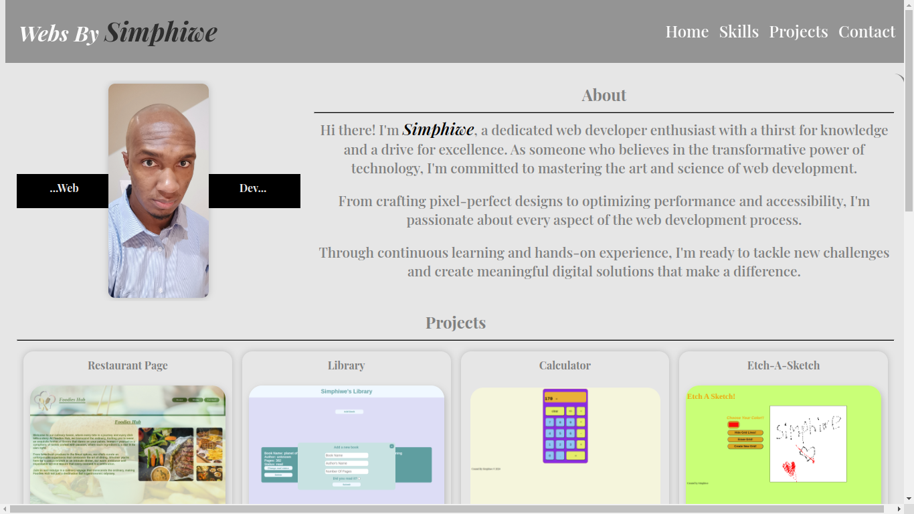
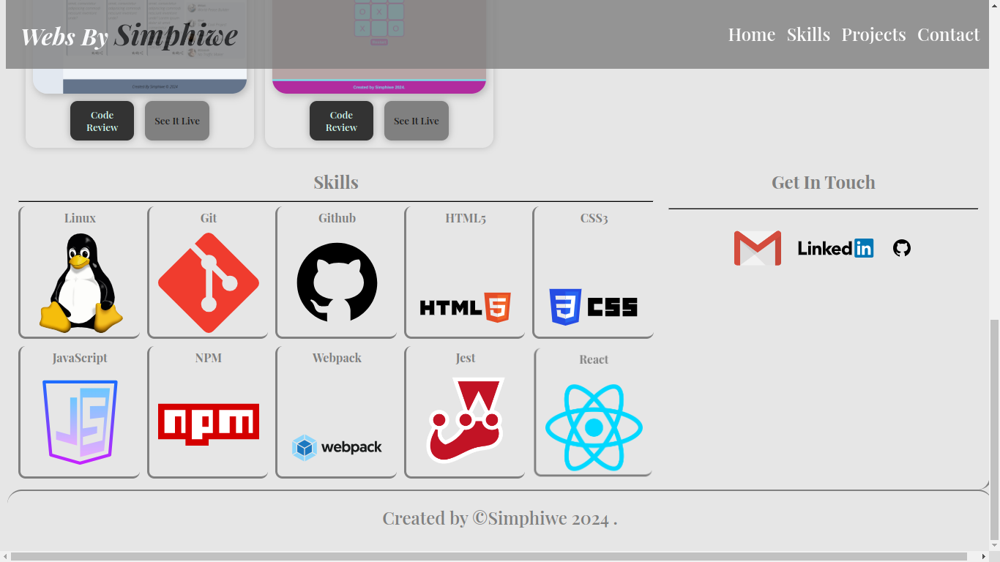

# **Personal Portfolio**

This is my portfolio website where I am showcasing some of the projects I have worked on. I regularly update it when I add a new **skill** under my belt or there is a project I want to add.

Check it _**LIVE**_ 👇
**<https://deebest.github.io/personal-webpage/>**

## Features

- The page has animation for smooth transitioning.
- It is responsive for any device.
- Contains projects I have worked on.
- Skills I have accomplished in my journey.

## Screenshots

## Tech stack used

- HTML
- CSS
- JavaScript

## Contact

Get in touch:

  
  
  

